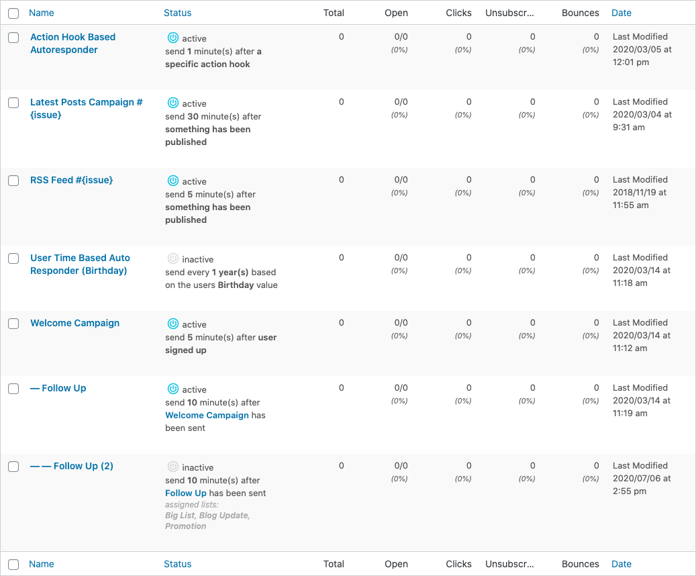

# Auto responder

Auto responder in Mailster help you to automate your email marketing.

?>Test this page on [our demo](https://demo.mailster.co/wp-admin/edit.php?post_status=autoresponder&post_type=newsletter).

With auto responders you can send campaigns to subscribers after a specific time and after a certain event. There are six types of auto responders available:

- Subscriber based auto responder
- Action based auto responder
- Time based auto responder
- User time based auto responder
- Follow up auto responder
- Action Hook based auto responder

### Subscriber based Auto responder

They are made to send messages to users on a specific action. These action can be

 - subscription
 - unsubscription

Read more on our [knowledge base](https://kb.mailster.co/working-with-subscriber-based-auto-responders/).

### Action based Auto responder

For automated campaigns when new content has been published.

Read more on our [knowledge base](https://kb.mailster.co/working-with-action-based-auto-responders/).

### Tine based Autoreponder

For automated campaigns in a specific time interval.

Read more on our [knowledge base](https://kb.mailster.co/working-with-time-based-auto-responders/).

### Action Hook based Autoreponder

For campaings triggered by custom actions from either third party plugins or via custom coding.

Read more on our [knowledge base](https://kb.mailster.co/working-with-action-hook-auto-responders/).

### Follow up Auto responder

For sending follow up emails and drip campaigns after certain actions.

Read more on our [knowledge base](https://kb.mailster.co/creating-a-series-in-mailster/).

## Prepare your Auto responder

This is how your Auto responder campaign can look like:

?> You can test this campaign on our [demo](https://demo.mailster.co/wp-admin/post.php?post=339&action=edit)

