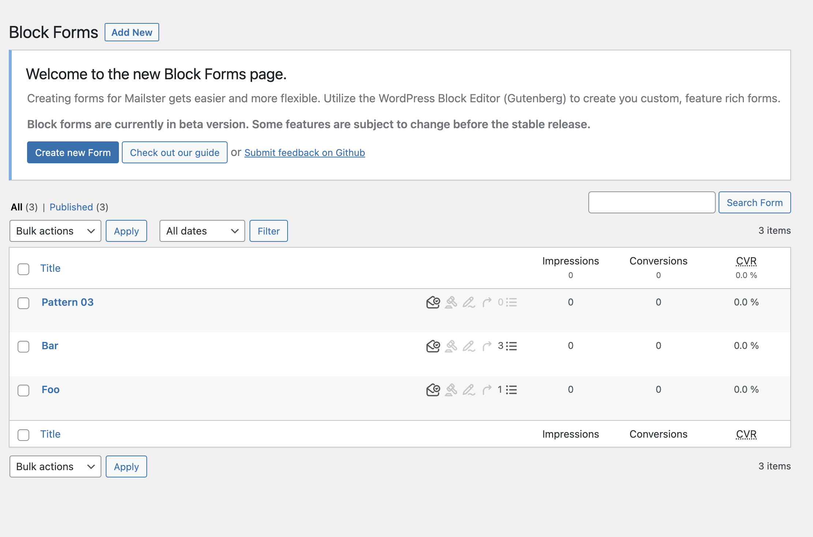
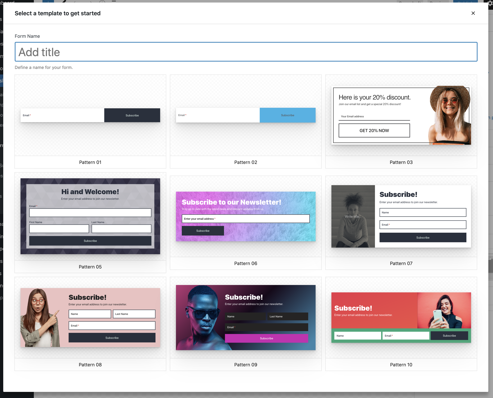
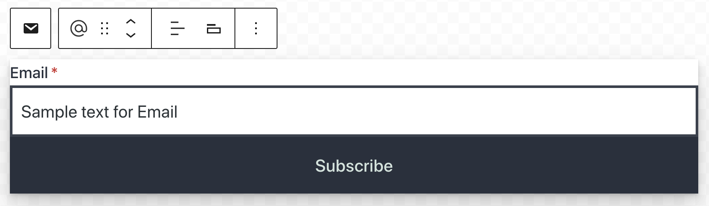

# Getting Started

!>**This is a BETA feature and requires a dedicate plugin. Some features are subject to change before the stable release.  
Please submit your [feedback on Github](https://github.com/everpress-co/mailster-block-forms/issues)**

If you click on the Block Forms menu entry you see an overview of your current existing block forms.

Once you have enabled the plugin you can find a new menu entry "Block Forms" in the Newsletter menu.

Click on "Add New" to create a new Block form.

## Select a template

You now can give you form a name and start with one of the predefined patterns.

If you close the modal Mailster will start with a basic form only containing the email address field and the submit button.

## Adding/Removing Form Fields

You can add additional fields to your form by adding them like other blocks in the Block editor. Click on the plus sign at the very top to get a list of available blocks.

?> Not all blocks are supported inside the form.

## Customize Form Fields

There are several ways to customize your form. The forms will inherit the styles of your current theme.

#### Labels

Define a label for the field.

#### Inline Labels

Enable this option will display the label inside the input field.

#### Required Field

Makes this field required. The email address is always required. The validation of the fields happens on the server side.

#### Show asterisk

Enable an asterisk (\*) after the label on required fields

#### Use native Form element

By default an email for is using `type="email"` for it's fields. This is recommend for accessibility. If disabled forms are always using `type="text"`.

!> Some sections are may not available depending on your WordPress version and used Theme.

#### Width

Define the width of the element. Since the form uses Flex box for the layout elements will show up in one line if the width is reduced to a certain point.

[Inspector](assets/block-forms/input-width.mp4 ':include :type=video controls autoplay width=100%')
