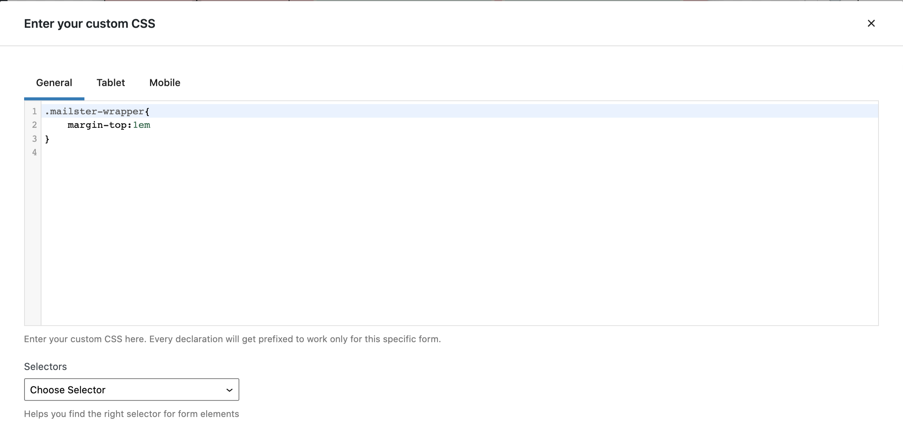

# Form Options

!>**This is a BETA feature and requires a dedicate plugin. Some features are subject to change before the stable release.  
Please submit your [feedback on Github](https://github.com/everpress-co/mailster-block-forms/issues)**

Each form has several options which help you customize the look and feel of your form.

To access the current form options click on "Form" in the inspector.

## Options

#### Form Name

Define a name of your form. This is usefully to recognize them at other places of your site.

#### Enable double op in

All subscriber who sign up will get a confirmation message where they have to confirm their email address.

#### GDPR compliant

enables a dedicate checkbox block on your form which must be checked in order to submit the from. This makes sure you get the consent of your subscribers to actually send emails to their email addresses. While this is required by law for all European citizens

#### Merge Data

Allow users to update their data with this form. Data like tags and lists will get merged together. This is useful if you have multiple forms on your site and people can sign up at various places to different lists.

#### Redirect after submit

Enter an URL to redirect people to a certain address after they have submitted the form.

#### Edit Error/Success Messages

Clicking this button reveals the hidden messages block to define the look and content of error and success messages.

## Double Opt in/Single Opt In

Define the content of the email confirmation message where people can confirm their email address. (Only if double-opt-in is enabled on this form)
You can use placeholder tags like `{firstname}` in all of the fields (except redirection)

#### Subject

The subject of the email.

#### Headline

Extra headline above the content of the email.

#### Content

The actual content of the email. Must include a `{link}` tag.

#### Linktext

The text of the link used in the content.

#### Redirect after confirm

You can redirect users to a specific URl once they click the confirmation link in the email.

## Lists

You can define which lists people get subscribed to if the submit the current form. While you can not use any list here it's recommend to have at least one list checked.

#### Users Choice

Decide if users can decide which lists the subscribe to. If checked a new block with selected lists will get added to your form. If unchecked users will get subscribed to all checked lists.

## Form Styles

Apply some basic styling to your forms here. You can define a text color (Color) and a background color. Sometimes a CSS rule with higher specificity will overwrite this settings.

## Input Styles

Define the style for your form elements. While you can do this for all form elements globally you can edit the styling of each individual element as well by licking on it and choosing the Input Styles options of that particularly form element.

## Custom CSS

Define additional CSS for your form here. Use the _General_ tab to apply CSS for every device, _Tablet_ only for tablet sized screens and _Mobile_ for mobile screen resolutions.

The _Selectors_ drop down will help you find the write selector for most common elements of Mailster Block Forms.

!>All selectors will be prefixed to only get applied to your current form to not affect other elements on your website.

## Placement <!-- {docsify-ignore} -->

Define where you like to display the form. Read more about that on [Placements](block-forms-placements).
