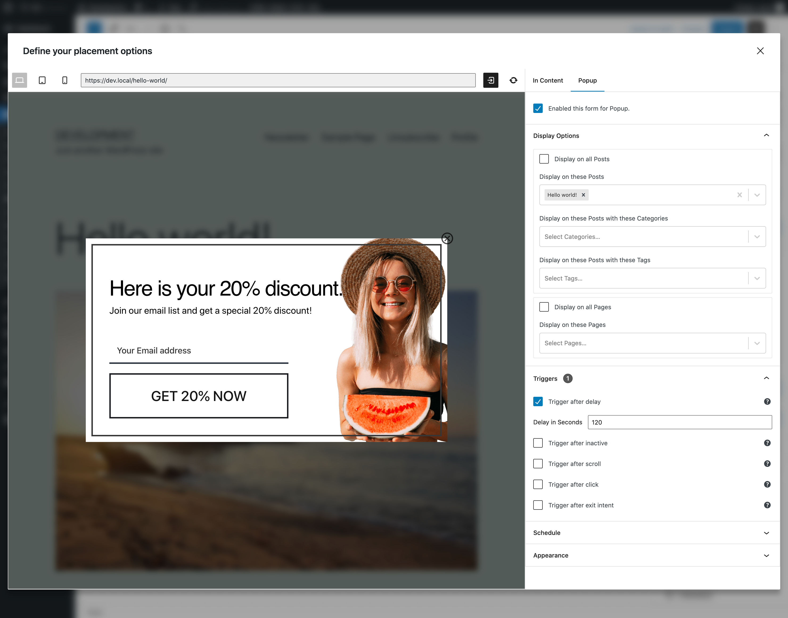

# Form Placements

!>**This is a BETA feature and requires a dedicate plugin. Some features are subject to change before the stable release.  
Please submit your [feedback on Github](https://github.com/everpress-co/mailster-block-forms/issues)**

The placement option let you define where and when your form should get displayed.

Currently you can display the form inside your content (blog post, page content, product description etc.)

There's an explicit way and an implicit way to display a form. The most common used is the implicit way where you define conditions and Mailster will determine - based on content type, time and user properties - to display the form or not.

### In Content

This option help you to display the form in your content. This is useful if you like to collect leads from your blog posts or on your product pages.

### Popup

Display your form as popup. This option give a lot of attention and users are more likely to subscriber to your newsletter.

#### Display Options

Define on which pages you like to display the form.

#### Triggers

If you use a popup form you have to decide how the popup gets triggered.

##### Trigger after delay

Show the form after a certain time on a single page. The timer will be reset if the page gets reloaded

##### Trigger after scroll

Show the form after a certain scroll position in percent is reached. 0% is the very top of the page and 100% is the very bottom of the page

##### Trigger after click

Show the form after the users clicks an element with a defined selector. Read more about selectors [here](https://www.w3schools.com/w3js/w3js_selectors.asp)

##### Trigger exit intent

Show the form after the users moves the mouse outside of the page. This often indicates leaving the page.

#### Schedule

Define time frames when the form gets displayed. This is useful if you have a promo running for a certain amount of time and don't like to have signups outside this time period.

Define the start and the end date when the form should get displayed. If you don't set any schedule the form will get displayed if the conditions in [Display Options](/block-forms-placements?id=display-options) meet

#### Appearance

Define further options how your form appear on your page. Theses settings are specific to the current display form.

