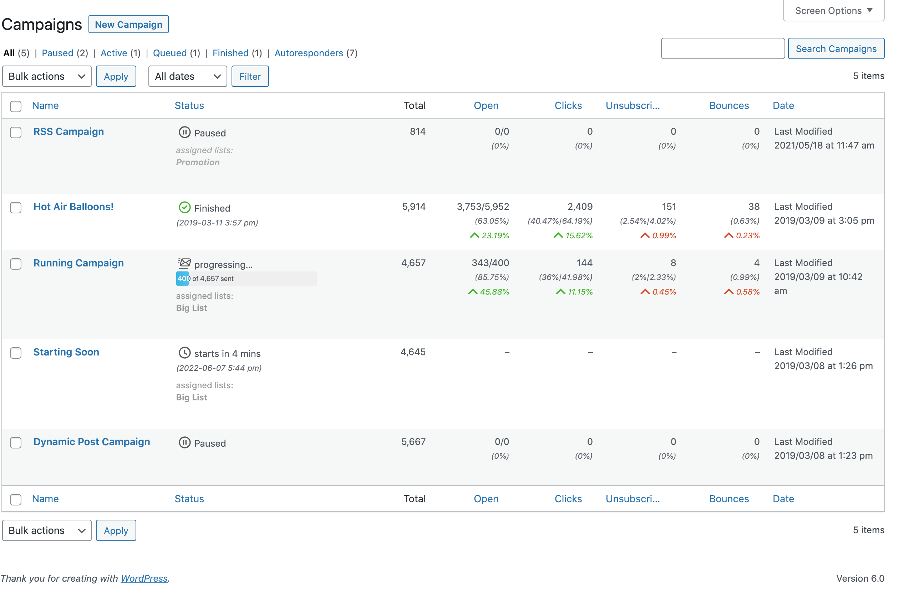
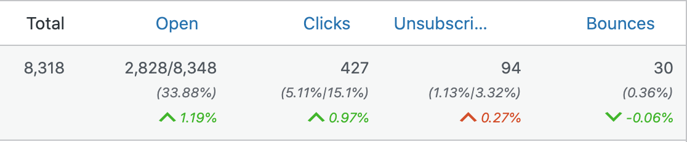
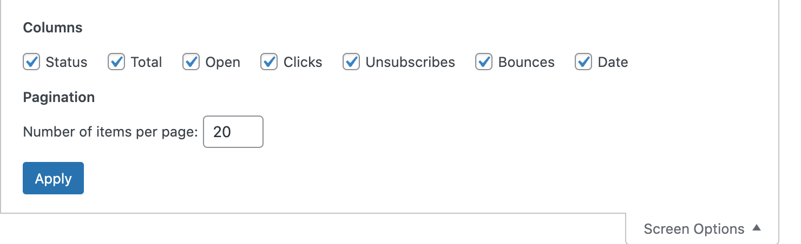

# Campaign Overview

The Campaign Overview page gives you a quick overview of all your campaigns. It's similar to the post overview page where all

On the subscribers overview page you can find all your subscribers sorted by their status.

?>Test this page on [our demo](https://demo.mailster.co/wp-admin/edit.php?post_type=newsletter).

## Campaign Statuses

Depending on your delivery date and if you have marked the campaign to delivery, each campaign can have up to five statuses.

### Paused

If a campaign was saved without the "Send this campaign" checkbox checked or an active campaign as been paused.

You can also pause an active campaign anytime to edit it. The web version will be accessible all the time.

### Queued

If the campaign is waiting for dispatch.

### Active

If the campaign is progression or right before to send.

### Finished

If all newsletters where sent the campaign is "finished" the date shows when the campaign has been finished.

### Draft

If you duplicate a campaign it's initial status is "Draft". You can also save a campaign as "Draft" which mean it's web version is not active.

### Sending Problems

If Mailster is not able to send your campaigns you will get an error indicator. Please get in touch with support if you cannot solve this issue.

!> If you don't have the capability to send campaigns a sixth status is available: "Pending". This requires someone with the right authority to send this campaign.

## Metrics

Metric are the indicators on how your campaigns are performing. While all **GREEN** indicators show better performing **RED** indicates a worse performing campaign at the specific metric.

!>All metric are compared across all campaigns within **your last year**.

This campaign has a **1.19%** better open rate (higher is better) and also a **0.27%** worse unsubscribe rate (lower is better).

By default you can see five metric on this page:

| Metric       | Sortable | Format         | Info                                                                                                                             |
| ------------ | -------- | -------------- | -------------------------------------------------------------------------------------------------------------------------------- |
| Total        | no       | `total`        | Shows either the total amount of subscribers which get this campaign (regular campaign) or the number sent mails (autoresponder) |
| Open         | yes      | `opens/sent`   | Shows the number of opens next to the actually sent emails as well the open rate (OR)                                            |
| Clicks       | yes      | `clicks`       | Shows the number of clicked emails and the click-through-rate (CTR) as well the adjusted-click-through-rate (ACTR)               |
| Unsubscribes | yes      | `unsubscribes` | Shows the number of people who has unsubscribed and the unsubscribe-rate (UR)                                                    |
| Bounces      | yes      | `bounces`      | Shows the number of bounced emails and the bounce-rate (BR)                                                                      |

?>Some columns are sort able by clicking on the name of the column.

You can remove certain columns by clicking on "Screen Options" at the top and uncheck the column you like to hide.

## Bulk Actions

You can run some bulk actions on all selected campaigns.

1. Select campaigns
2. Choose the bulk action
3. Click on "Apply"

| Action        | Info                                                              |
| ------------- | ----------------------------------------------------------------- |
| Move to Trash | Moves the selected campaigns. into the trash.                     |
| Duplicate     | Duplicate the campaigns.                                          |
| Start         | Starts the selected campaigns (if applicable).                    |
| Pause         | Pauses the selected campaigns (if applicable).                    |
| Resume        | Resumes the selected campaigns (if applicable).                   |
| Finish        | Finish the selected campaigns (if applicable). Cannot be undone.  |
| Pause         | (Re)sends the confirmation message (for double opt in) if needed. |
| Activate      | Activates selected autoresponder                                  |
| Deactivate    | Deactivates selected autoresponder                                |
