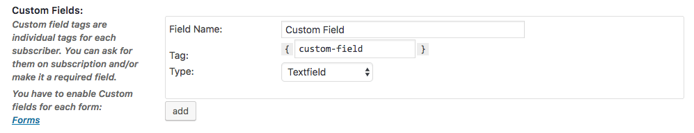

# Custom Fields

With custom fields you can add additional information to your subscribers.

By default Mailster stores following info of your subscribers (if provided):

-   Email address (_required_)
-   Firstname
-   Lastname
-   Signup Date
-   Confirmation Date \*
-   IP Address \*

\*depends on your settings.

!> Other custom data like Gender, Company Name, Telephone number, Twitterhandle etc. must be stored in custom fields.

## Create custom fields

You can create new custom fields on the settings page ([Subscribers tab](/settings-subscribers)).

| Field      | Info                                                                                                                           |
| ---------- | ------------------------------------------------------------------------------------------------------------------------------ |
| Field Name | The name of the field                                                                                                          |
| Tag        | The tag for this field. Can be used in campaings with `{custom-field}`. Allowed characters: `a-z0-9\_-                         |
| Type       | Type of the field with different options. Possible: `Textfield` `Textarea` `Dopdown Menu` `Radio Buttons` `Checkbox` or `Date` |
