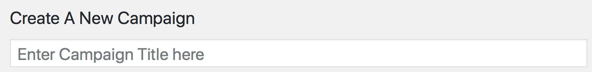
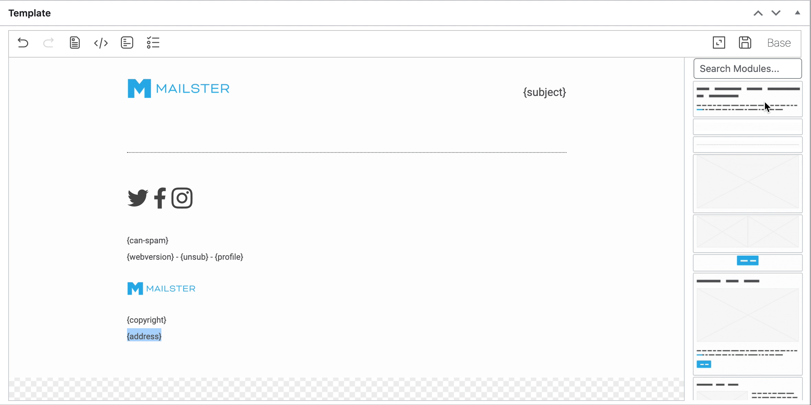
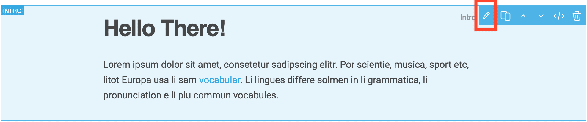
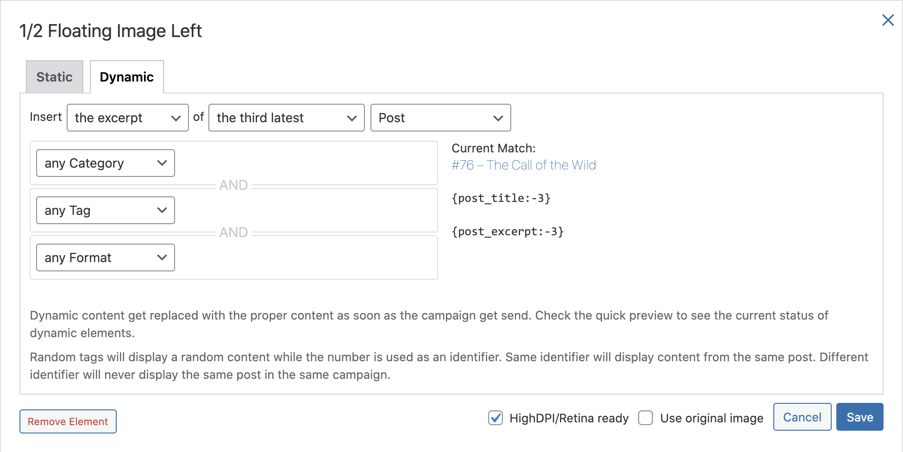

# The Campaign Editor

The campaign editor is the heart of Mailster an allows to quickly build your campaigns. You can also create Autoresponder as well Notification templates.

?>Test this page on [our demo](https://demo.mailster.co/wp-admin/post-new.php?post_type=newsletter&template=mymail).

Similar to Post in WordPress you create a new campaign by clicking on the _New Campaign_ sub menu entry.

## Campaign Title

First choose a title for your campaign. The subject could be the same as the title but it's totally up to you. The title is public in some cases ([web version](/frontpage)).

## Campaign Details

This metabox let you define mostly meta info to your campaign. Some fields are also defined globally in the settings and can get overwritten on each campaign.

Most templates are prepared for "Preheaders" texts. Please see [this section](/preheaders) for more info about preheaders. You can define the senders email address, name and the address people can reply to.

### Optionbar

With the option bar you can

-   undo/redo the last change of your template.
-   remove all modules from the template.
-   switch to codeview to edit the HTML source of your template.
-   switch to plain text view to edit the alternative text for email clients which do not support HTML.
-   preview the campaign.
-   enable "distraction free writing".
-   open the save dialog to create new template files based on you current one.
-   switch templates and template files.

### Adding Content

To add new content you have to add new modules and fill them with content.

You can find the modules of you current template in the module bar on the right (or on the left if you're using a RTL language).

You can either click on a module or drag it into the editor to add it to you current campaign. You can rearrange modules by dragging them into the new position or using the arrows on the right.

The modules in the module bar contain screenshots of the module. If you can only see the name of the module the screenshots havn't been created yet.

!> It can take several minutes before the screenshots show up.

### Editbar

Depending on what you like to edit the editbar adobt the look.

##### PicPicker editbar

If you click on an editable image the editbar will be a picpicker to choose an image from.

#### Automatic insertion

Some modules offer an button on the right side to insert whole posts including headline, content, button with link to the article and the feature images (if exists).

You can than insert either _static_ or _dynamic_ content.

##### Static editbar

##### Dynamic editbar

## Delivery Options

The Delivery Meta Box is separated into two options: Regular Campaign and Auto responder.

### Regular Campaign

A Regular Campaign is a campaign which get sent once to each subscriber. The receivers can get defined in the Receivers Meta Box.

If you don't check the **Send this Campaign** checkbox you wont be able to send your campaign.

You can define any date in the future or leave the current date to send the campaign immediately when you hit the save button (Please check out the Cron Job section to know how campaigns get sent in Mailster).

To test your campaign with your email client enter your email and hit the send button.

### Autoresponder

Please check the [Auto responder](/autoresponder) section for more information.

!> All emails will get sent with your servers time! Please compare your local time with the time at your server.

## Receivers

On the Receivers Meta Box you can limit the receivers for the current campaign.

You can either send to specific lists or send to all available subscribers (List doesn't matter)

Furthermore you can limit the Receivers by choosing several conditions.

## Options

You can overwrite the global tracking options for your site for each campaign.

You can also change the colors of your newsletter with the color option on the right. Click the arrows to the right to reset each field or save your newly created color schema to reuse it later.

## Saving options

Either though Mailster uses the WordPress native auto save methods you should save your campaigns regularly. If you have checked the option to send the campaign Mailster will either queue it or start sending the campaign based on the defined options.

### Web version

If you uncheck the web version checkbox you don't have a public version of you campaign. This is useful for content you only like to have in your email marketing.

### Password protected web version

To protect the web version with a password simple add it to the given box. Users are forced to enter this password in order to see the web version.
