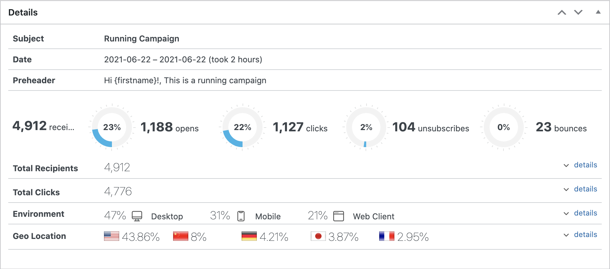
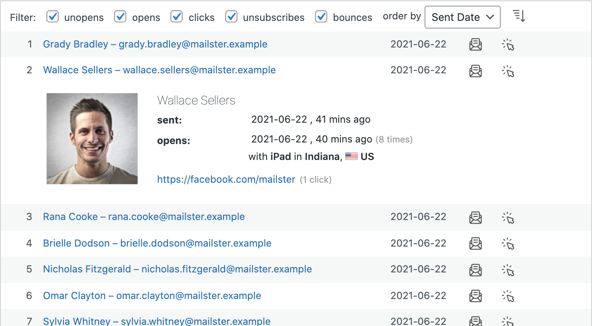
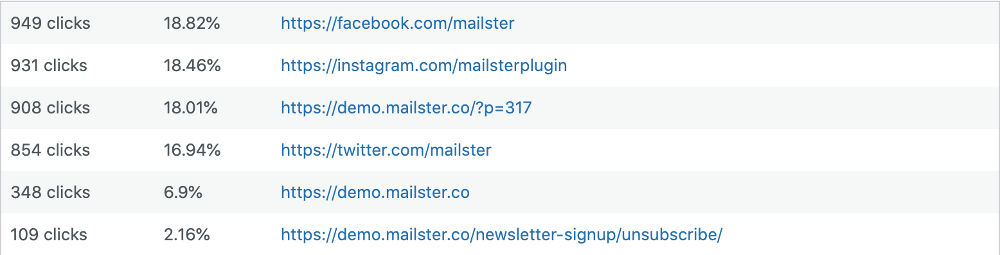
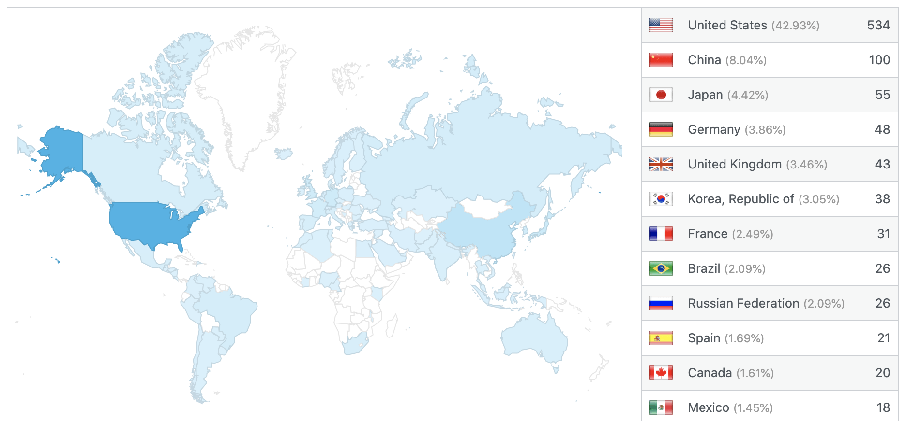

# Finished Campaigns

Mailster provides detailed statistics about your campaigns and the subscribers who opened it.

!> If your campaign is finished or currently progressing you are not able to edit it.

You can expand up to four section to reveal more details:

### Total Recipients
Gives you a detailed list of all receivers. Subscribers which haven't received the campaign yet are not included. You can filter the list and define the order.

### Total Clicks
Overview of clicked links, including amount and percentage starting with most clicked links.

### Environment
Overview of used Devices and version. All devices are divided in either Desktop, Mobile or WebClient.

### Geo Location

Provides an overview of the location where your campaigns has been opened \*. You can click on an individual country to get the city data (requires track geo locations in the settings).

 \* Geodata is provided by Maxmind.com

You can find small boxes  over the links which were clicked. More clicks means a higher percentage.