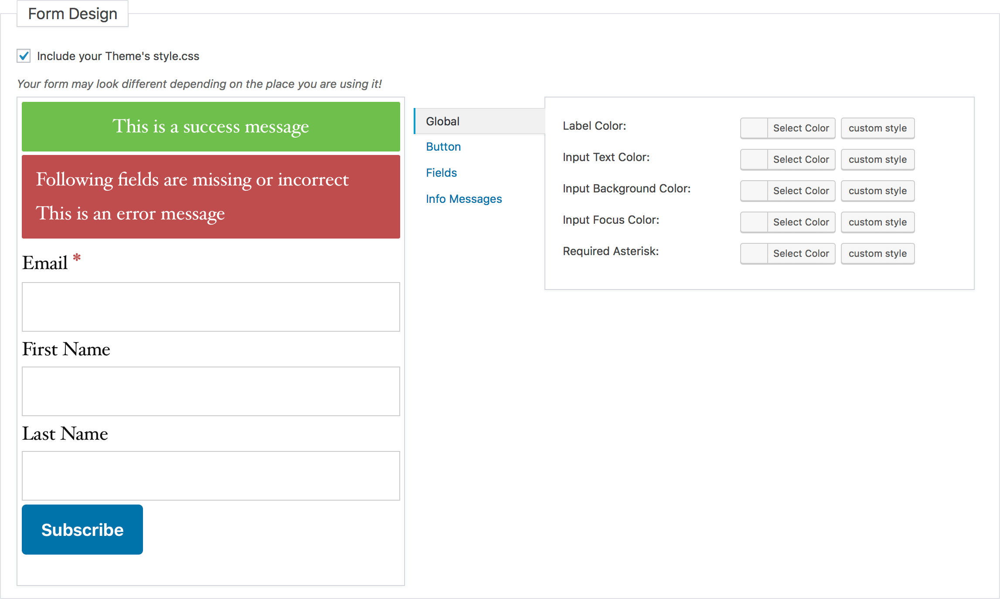
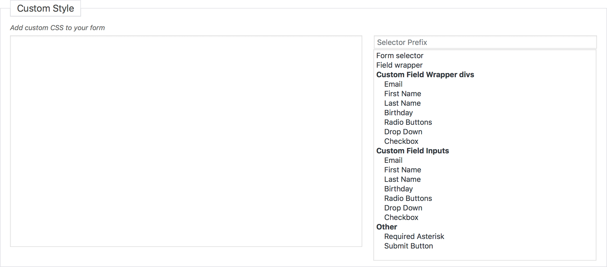

# Forms Design

This page allow you to change the look of the form.

!> Depending on you sites _style.css_ the form on your site may look different.

?>Test this page on [our demo](https://demo.mailster.co/wp-admin/edit.php?post_type=newsletter&page=mailster_forms&ID=1&tab=design).

Define different colors for your form elements with the color pickers on the right.

### Add custom CSS to your form

You can quickly add custom CSS to your form.

By clicking on the selectors on the right Mailster will prepare your CSS rule.
