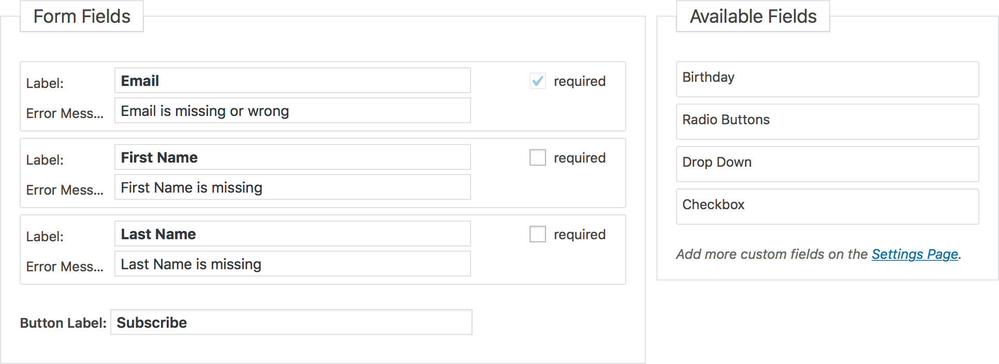

# Forms Fields

Each form in Mailster has form fields. By default you can add three fields to your form:

- Email (required)
- First Name
- Last Name

You can add additional fields if you have defined any [custom field](/custom-fields).

?>Test this page on [our demo](https://demo.mailster.co/wp-admin/edit.php?post_type=newsletter&page=mailster_forms&ID=1).

You can drag **Available Fields** from the right into the **Form Fields** area to add your fields to the form. Rearrange fields by drag n drop.

If you check the "required" checkbox users must fill out the field to submit the form.

