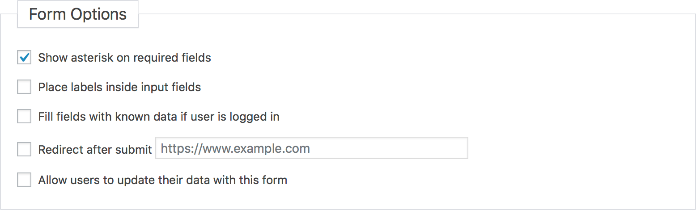
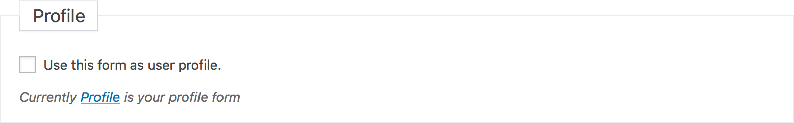
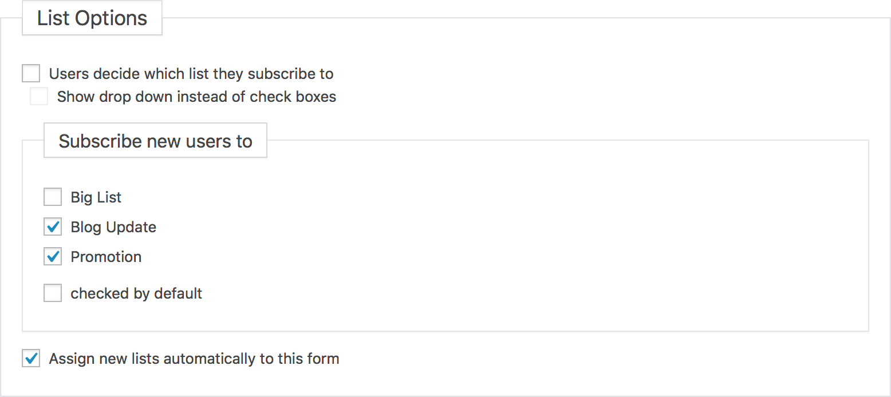

# Forms Settings

On the form settings page you can define how your form should work.

?>Test this page on [our demo](https://demo.mailster.co/wp-admin/edit.php?post_type=newsletter&page=mailster_forms&ID=1&tab=settings).

### Form Options

##### Show asterisk on required fields

Will display an asterisk (\*) on your form labels to indicate it's a required field.

##### Place labels inside input fields

Will use the placeholder tag to display the form label.

##### Fill fields with known data if user is logged in

If the user is logged in Mailster tries to prefill the form fields.

##### Redirect after submit

Redirects after submission.

##### Allow users to update their data with this form

If people who are already registered submit this form they will just update their information.

### Profile

If this option is checked Mailster will use this form and it's settings for the Profile where users can update their subscriptions.

### List Options

You can decide if users can decide to which lists they sign up to.

If you choose to **Assign new lists automatically to this form** Mailster will add new created lists to this form automatically.

### Double/Single Opt in

While Double opt in is required by law in many countries (GDPR!) you can switch to single opt in here.

!> People will not get a confirmation message if you choose Single Opt In!

You can define the content of the confirmation message Mailster will send to people who sign up via this form.
