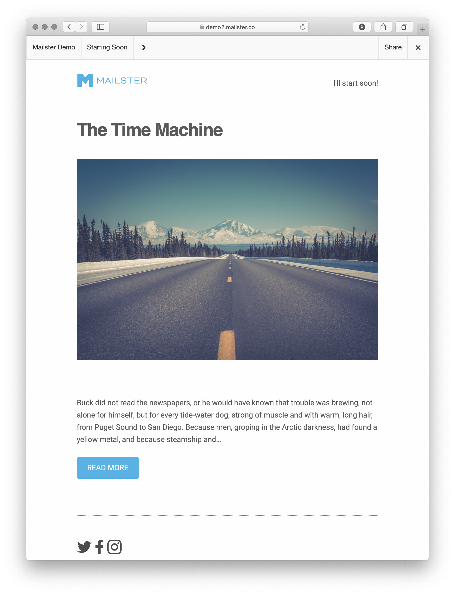

# Frontpage or web version

The Frontpage displays your newsletter as a "web version". It provides a top bar with a link to your homepage, the title of the displayed campaign, a next and previous button to display the next or previous campaign (if exists), an optional share button and a button to close the frame.

With the share button users can share the newsletter via different social media services, bookmark services, via email or via link.

?>See this front page live on [our demo](https://demo.mailster.co/newsletter/starting-soon/).

