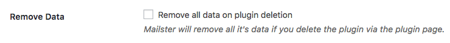

# Installation

You can download two versions of the Mailster package from CodeCanyon.

#### All files & documentation

Contains all files you get with the purchase.

#### Installable WordPress file only

Contains only a _mailster.zip_ file you can upload directly to your WordPress site.

To get this plugin working you have to follow these steps

-   extract the download zip (only if you downloaded the whole package).
-   log in to your WordPress site
-   goto "Plugins" => "Add new" => "Upload"
-   Select zip archive "mailster.zip"
-   Click "Upload" and wait until the file was uploaded and extracted.
-   Click "Activate Plugin"
-   Follow the setup Wizard

## Setup Wizard

The Setup Wizard helps you to setup Mailster by defining some basic values.

### Basic Information

Mailster needs some essential informations like your personal information and also some legal stuff.

### Newsletter Homepage Setup

This is where your subscribers signup, manage or cancel their subscriptions.

### Delivery Options

How Mailster should delivery you campaigns.

### Privacy

Mailster takes the privacy of your subscribers information seriously. Define which information Mailster should save.

### Validation

Updates are important and if you have a valid license for Mailster you can automatically update directly from WordPress.

## Uninstall Mailster

You can uninstall Mailster anytime. By default all settings and campaigns as well your subscribers with statistics will be preserved so you can install Mailster again at a later time.

### Delete all settings

If you like to delete all data from Mailster including campaigns, subscribers, custom fields and actions, you have to check the Remove Data checkbox.

