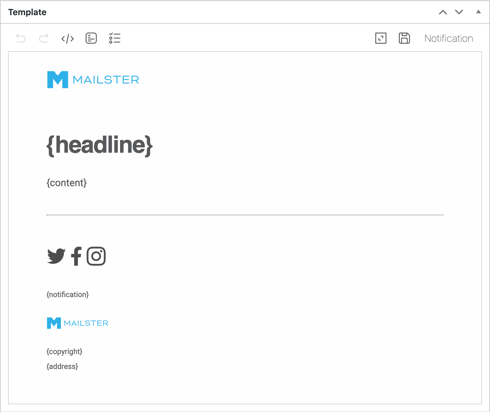

# Notifications Template

Mailster can also send transactional emails which are not part of a campaign. For these emails a special **Template file** is used.

By default it is the `notification.html` template file in your template folder but can any file which contains at least two tags:

-   `{headline}` (for the headline or subject)
-   `{content}` (for the actual content of the email)

This file is used of Mailster sends

-   Double Opt In Confirmation
-   Notification about new users

?>Test this page on [our demo](https://demo.mailster.co/wp-admin/post-new.php?post_type=newsletter&template=mymail&file=notification.html).

You can also send all outgoing mails from your WordPress site with this template. Mailster can wrap the template around the content.
