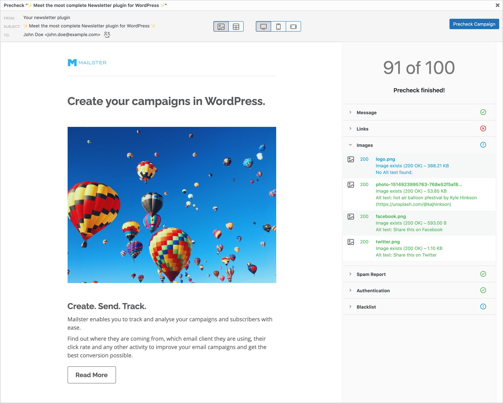

# Precheck your Campaigns

Mailster allows you to quickly test your campaigns with our precheck feature.

#### Messages

Checks your subject line for best practice and returns hard facts about your email copy.

#### Links

Does a link check on all found links in your email. It also reveals potential redirects on these links. Links must be publicly reachable in order to work correctly.

#### Images

Checks the existence of your used image and if they are publicly reachable. Shows warning if the alt tag is missing.

#### Spam Report

Shows the result of the SpamAssasin extension including a Spam score

#### Authentication

Checks various Authentication methods to improve deliverability like SPF, DMARC, DKIM, A and MX Records as well Reverse DNS entries.

#### Blacklist

Check your servers IP address against over 50 blacklists.