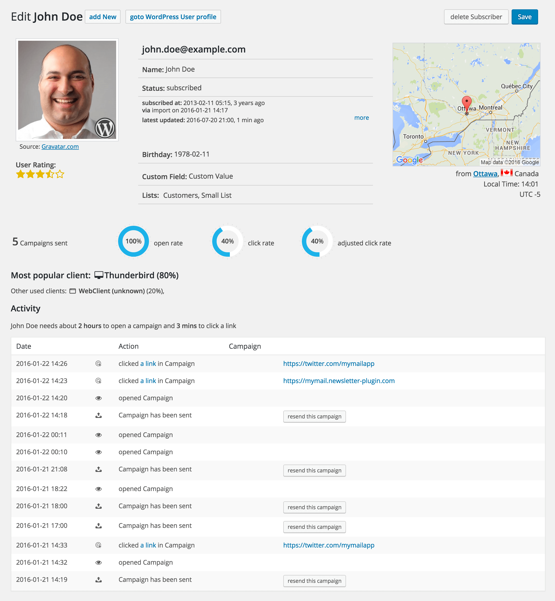

# Subscriber Detail

For each subscriber you get a detail page with more information.

On this page you find following infos:

-   Email address
-   Name \*
-   Status
-   Subscription related info \*
-   GDPR consent given timestamp \*
-   Custom fields \*
-   List assignments
-   User Avatar \*
-   Geo location \*
-   Timezone and Local time \*
-   Used Email Clients \*
-   Activity including opens and click. \*
-   Total number of sent campaigns.
-   Open, click and adjusted click rate. \*

\* if available

?>Test this page on [our demo](https://demo2.mailster.co/wp-admin/edit.php?post_type=newsletter&page=mailster_subscribers&ID=5995).

!> Mailster Subscribers are not WordPress users but can be connected to each other. [Read more](https://kb.mailster.co/wordpress-users-in-mailster/).

