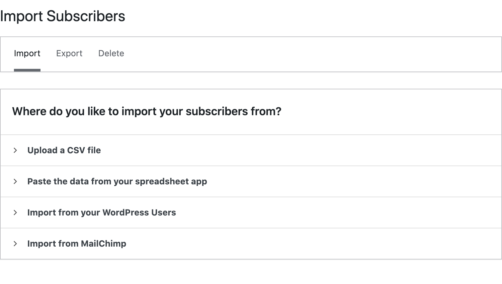
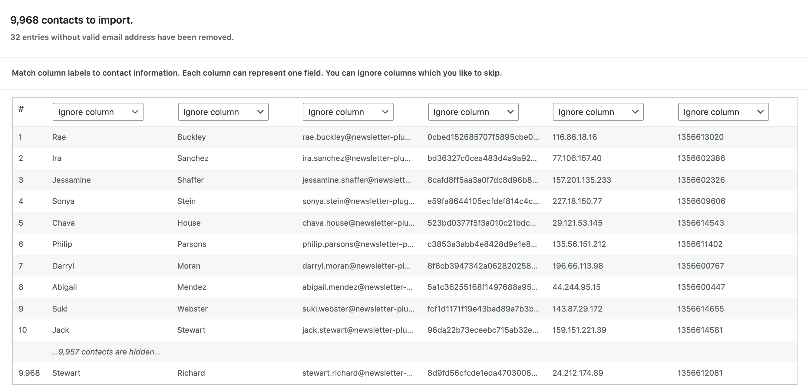

# Manage Subscribers

With Mailster you can simple import and export your subscribers.

## Import Subscribers

On the Import page you can upload your CSV file or paste your contacts from your spreadsheet app into the textarea.

?>Test this page on [our demo](https://demo.mailster.co/wp-admin/edit.php?post_type=newsletter&page=mailster_manage_subscribers).

### Select Columns

If you data has been uploaded to your server you get a raw preview of your contacts.

Select the field from the dropdowns to map the fields from your input file.

### Import Options

In the import options you can define further settings.

You can define which lists the new contacts are imported to as well the status of the subscribers.

!> Choosing **pending** as status will force a confirmation message to the subscribers.

If an subscriber already exits you can choose between three options how Mailster handle the import:

-   _Skip_: Skips the subscriber and the existing one with all it's data will stay
-   _Overwrite_: Overwrite existing users but keeps all actions for statistics
-   _Merge_: Merge existing users with new on so missing fields can get filled up

Some Autoresponders may require a signup date. If it's not defined in the import data and mapped correctly you can define it explicitly here.

!> Make sure you have the permission to import your email addresses!

## Export Subscribers

You can export all of your subscribers into a CSV or XLS (Excel) file.

?>Test this page on [our demo](https://demo.mailster.co/wp-admin/edit.php?post_type=newsletter&page=mailster_manage_subscribers&tab=export).

!> The file has to be prepared on your server and can take a while before it's accessible.

### Segment Exported Subscribers

You don't have to download all you subscriber at once but can segment them into separated lists. Mailster allows to separate them into.

-   _Lists_: Choose which lists you like to export.
-   _Conditions_: Apply conditions to your subscribers ([Read more](https://kb.mailster.co/segmentation-in-mailster/)).
-   _Status_: Choose the status of your subscribers.

### Output Options

You can define further options on how Mailster should prepare the download file.

### Define Columns

Define which fields Mailster should export. You can drag and drop the columns to define the order.

## Delete Subscribers

Similar to Export Subscribers you can also Delete subscribers. While you can delete subscribers from the Subscribers Overview page it's faster to process large batches via this page.

-   _Lists_: Choose which lists you like to delete.
-   _Conditions_: Apply conditions to your subscribers ([Read more](https://kb.mailster.co/segmentation-in-mailster/)).
-   _Status_: Choose the status of your subscribers.

### Remove selected lists

This option will remove lists selected above.

### Remove all actions from affected users

This option will remove all actions like _clicks_, _opens_, _bounces_ _unsubscribes_ of the selected users.
