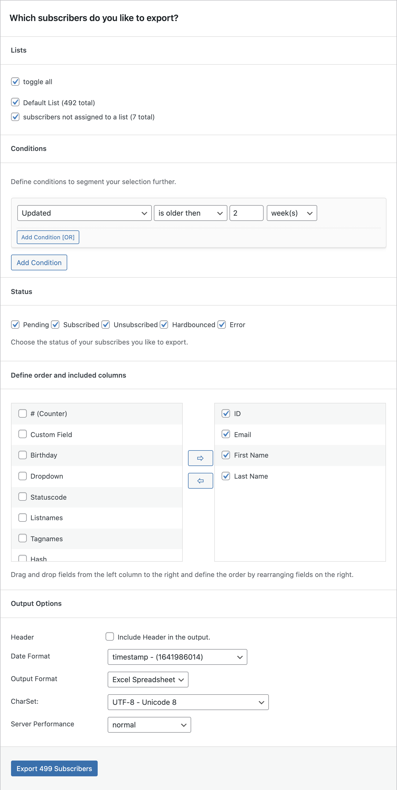

# Manage Subscribers

With Mailster you can simple import, export and bulk delete your subscribers.

## Import Subscribers

The import screen gives you various options to import your contacts into Mailster.

-   [Upload a CSV file](#upload-a-csv-file)
-   [Paste the data from your spreadsheet app](#paste-the-data-from-your-spreadsheet-app)
-   [Import from your WordPress Users](#import-from-your-wordpress-users)
-   [Import from MailChimp](#import-from-mailchimp)

!>Mailster will remove lines without a valid email address automatically.

?>Test this page on [our demo](https://demo.mailster.co/wp-admin/edit.php?post_type=newsletter&page=mailster_manage_subscribers).

#### Upload a CSV file

This option allows you to drag and drop your CSV file or upload it by clicking on the "Select File" button.

#### Paste the data from your spreadsheet app

This option allows you to paste the data into a textarea. If you have you spreadsheet app like Excel or Numbers open you can simple copy and paste all your contacts into this field.

#### Import from your WordPress Users

This option allows you to import your existing WordPress user.

#### Import from MailChimp

This option allows you to import contacts from your Mailchimp account. This requires an [additional (free) plugin](https://wordpress.org/plugins/mailster-mailchimp/) and your Mailchimp API key.

### Select Columns

If you data has been uploaded to your server you get a raw preview of your contacts.

Select the field from the dropdowns to map the fields from your input file.

### Import Options

In the import options you can define further settings for your current import.

You can define which lists the new contacts are imported to as well the status of the subscribers.

!> Choosing **pending** as status will force a confirmation message to the subscribers.

If an subscriber already exits you can choose between three options how Mailster handle the import:

-   **Skip**: Skips the subscriber and the existing one with all it's data will stay
-   **Overwrite**: Overwrite existing users but keeps all actions for statistics
-   **Merge**: Merge existing users with new on so missing fields can get filled up

Some Autoresponders may require a signup date. If it's not defined in the import data and mapped correctly you can define it explicitly here.

!> Make sure you have the permission to import your email addresses!

## Export Subscribers

You can export all of your subscribers into a CSV or XLS (Excel) file.

?>Test this page on [our demo](https://demo.mailster.co/wp-admin/edit.php?post_type=newsletter&page=mailster_manage_subscribers&tab=export).

!> The file has to be prepared on your server and can take a while before it's accessible.

### Segment Exported Subscribers

You don't have to download all you subscriber at once but can segment them into separated lists. Mailster allows to separate them into.

-   **Lists**: Choose which lists you like to export.
-   **Conditions**: Apply conditions to your subscribers ([Read more](https://kb.mailster.co/segmentation-in-mailster/)).
-   **Status**: Choose the status of your subscribers.

### Output Options

You can define further options on how Mailster should prepare the download file.

### Define Columns

Define which fields Mailster should export. You can drag and drop the columns to define the order.

## Delete Subscribers

Similar to Export Subscribers you can also Delete subscribers. While you can delete subscribers from the Subscribers Overview page it's faster to process large batches via this page.

?>Test this page on [our demo](https://demo.mailster.co/wp-admin/edit.php?post_type=newsletter&page=mailster_manage_subscribers&tab=delete).

-   **Lists**: Choose which lists you like to delete.
-   **Conditions**: Apply conditions to your subscribers ([Read more](https://kb.mailster.co/segmentation-in-mailster/)).
-   **Status**: Choose the status of your subscribers.

### Remove all actions from affected users

This option will remove all actions like _clicks_, _opens_, _bounces_ _unsubscribes_ of the selected users.

### Automation

Mailster can keep your list clean and healthy by removing contacts based on defined conditions. Mailster will check your contacts daily and mark matching ones as "deleted".

!> All subscribers with status of deleted will get removed automatically after **14 days**

#### Common Automation jobs

##### Remove all people who have unsubscribed from a certain list

##### Remove all people who bounced or causes an error after 1 month

##### Remove all people who have a bad rating and didn't opened a campaign within the last 3 month.

