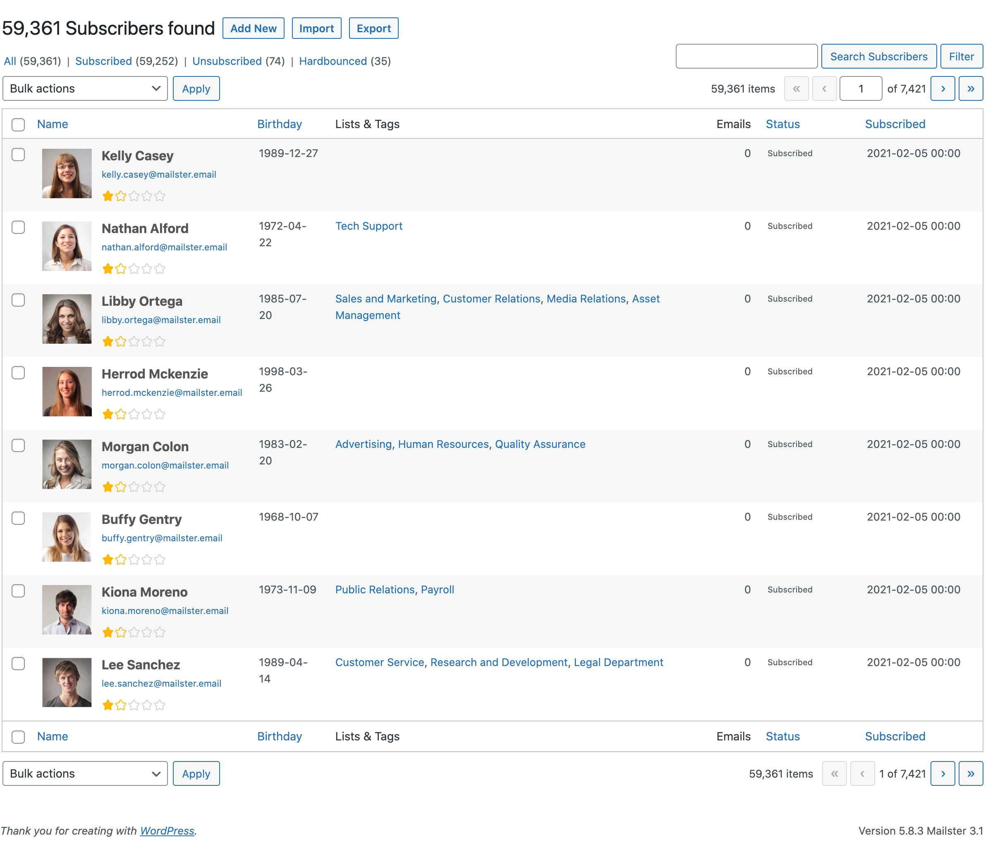

# Subscribers Overview

Mailster allow to manage all your subscribers inside your WordPress installation. They are stored in tables in the same database as the regular tables from WordPress.

On the subscribers overview page you can find all your subscribers sorted by their status.

?>Test this page on [our demo](https://demo.mailster.co/wp-admin/edit.php?post_type=newsletter&page=mailster_subscribers).

## Search subscribers

You can search for certain subscribers by using the search input field on the upper right.

#### Search modifier

You can use some modifiers to limit the results of your search:

| Searchterm             | Info                                                                                                                                                                     |
| ---------------------- | ------------------------------------------------------------------------------------------------------------------------------------------------------------------------ |
| `My search term`       | This will return subscribers with "My", "search" **OR** "term" in either their email address, hash, name or any custom field.                                            |
| `My +search +term`     | To force an **AND** connection use a plus sign before each term.                                                                                                         |
| `"My search term"`     | This will return subscribers with "My search term" in either their email address, hash, name or any custom field.                                                        |
| `My search term -ugly` | This will return subscribers with "My", "search" **OR** "term" in either their email address, hash, name or any custom field but not with "ugly" on one of these fields. |
| `term?`                | Finds either "term" **OR** "terms"                                                                                                                                       |
| `term*`                | Finds anything that starts with "term" e.g. "term", "terms" **OR** "Terminator".                                                                                         |

!> Searches can be very time consuming especially with a large subscriber base!

## Bulk Actions

You can run some bulk actions on all selected subscribers.

1. Select subscribers
2. Choose the bulk action
3. Click on "Apply"

| Action                   | Info                                                                                                  |
| ------------------------ | ----------------------------------------------------------------------------------------------------- |
| Delete                   | Deletes all selected subscribers but keep their activities by un-assigning the subscriber info.       |
| Delete (with Activities) | Deletes all selected subscribers including their activities.                                          |
| Send new Campaign        | Send a new campaign to selected subscribers.                                                          |
| Resend Confirmation      | (Re)sends the confirmation message (for double opt in) if needed.                                     |
| Verify                   | Runs a verification on the selected subscribers. Helpful if you have implemented custom verification. |
| change status            | Updates the status of the selected subscribers.                                                       |
| add to list              | Adds selected subscribers to chosen list.                                                             |
| remove from list         | Removes selected subscribers to chosen list.                                                          |
| confirm lists            | Confirms pending subscriptions to chosen list (without confirmation email).                           |
| unconfirm lists          | Unconfirms subscriptions to chosen list (may force confirmation email).                               |
