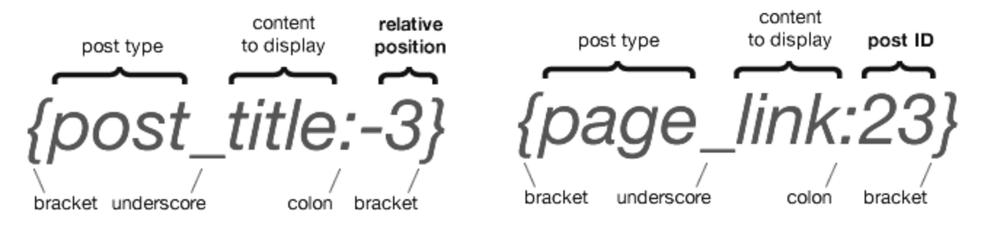

# Tags
Tags are placeholder for your newsletter. You can set them anywhere in your newsletter template with the format `{tagname}`. Custom field tags are individual for each subscriber.

You can set alternative content with `{tagname|alternative content}` which will be uses if `[tagname]` is not defined. All unused tags will get removed in the final message

Check out the "Tags" Tab on the Settings page!

### Dynamic Tags

A dynamic tag is wrapped in **brackets** like the other tags and start with the **post type** followed by an **underscore** and the **content to display**. After a colon can be a negative integer like **-3** which represents the third latest entry of the selected post type.

!> You can also use absolute values like 23 to use the content from the post with the ID 23

#### Relative tags and absolute tags explained

#### Some examples:

Tag | Info
--- | ---
`{post_title:-1}` | displays the latest post title
`{page_title:-4}` | displays the fourth latest page title
`{post_image:-1}` | displays the feature image of the latest posts (used in the URL field of the editbar)
`{post_image:-4\|23}` | displays the feature image of the fourth latest posts. Uses the image with ID 23 if the post doesn't have a feature image (**used in the URL field of the [editbar](editor?id=picpicker-editbar)**).
`{post_content:-1}` | displays the latest posts content
`{post_excerpt:-1}` | displays the latest posts excerpt or content if no excerpt is defined
`{post_date:-1}` | displays the latest posts date
`{post_title:23}` | displays the post title of post ID 23
`{post_link:15}` | displays the permalink of post ID 15

!> Instead of "**post_**" and "**page_**" you can use custom post types too

Reserved Tags
Following tags are reserved and cannot be used as custom tags:

`{unsub}`, `{unsublink}`, `{webversion}`, `{webversionlink}`, `{forward}`, `{forwardlink}`, `{subject}`, `{preheader}`, `{profile}`, `{profilelink}`, `{headline}`, `{content}`, `{link}`, `{email}`, `{firstname}`, `{lastname}`, `{fullname}`, `{year}`, `{month}`, `{day}`, `{share}`, `{tweet}`