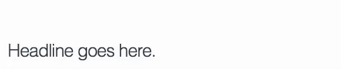
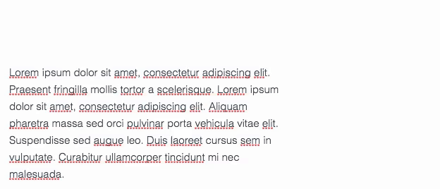

# Mailster Templates

Create custom templates for Mailster.

## General Idea

- A __Mailster Template__ is a folder containing all individual __Template Files__ and required assets.
- A __Mailster Template__ can have multiple __Template Files__.

## Structure

A __Mailster Template__ includes at least two  __Template Files__:

 - index.html
 - notification.html

!> You can add additional __Template Files__ in this folder.

While the _index.html_ file contains all available modules the _notification.html_ file contains only a text area which is used for notifications (e.g. confirmation, new subscriber infos and mails used by WordPress with the `wp_mail()` method.

Each __Template File__ must include a header, similar to the header of a WordPress Theme:

```html
<!--
    Template Name: Your Template Name
    Template URI: https://example.com
    Description: Some short description of your template
    Author: Your Name
    Author URI: https://example.com
    Version: 1.0
-->
```

Name | Info
--- | ---
Template Name | The Name of your __Template__
Name (_optional_) | The Name of your __Template File__
Template URI (_optional_)| The URL of your template
Description (_optional_) | A short description to describe your __Template__
Author | The name of the creator
Author URI (_optional_)| The URL of the creator
Version | current version number


Each __Template File__ is structured as following:

- header
- modules
   - module
   - module
   - ...
- footer

!> The `header` and `footer` can also be inside the modules but only if a `<module>` tag is wrapping the HTML.

Let's take a look at this example
```html
<!--
    Template Name: Your Template Name
    Template URI: https://example.com
    Description: Some short description of your template
    Author: Your Name
    Author URI: https://example.com
    Version: 1.0
-->
<html>
    <head>
    <title>{subject}</title>
   </head>
   <style>
      //some styling here
   </style>
<body>
<modules>
   <module> </module>
   <module> </module>
</modules>
</body>
</html>
```

## Preheader

Preheader is used to display a short info in the preview pane of the email client

To make preheaders work correctly you have to add a `{preheader}` tag in your templates. Best is to wrap it in a div a hide it by default with CSS:

```html
<div class="preheader">{preheader}</div>
```

```css
/* make sure the Preheader is hidden by default in all Email Clients */
div.preheader{
    line-height:0px;
    font-size:0px;
    height:0px;
    display:none;
    visibility:hidden;
}
```
You can also inline styles directly:

```html
<div style="line-height:0px;font-size:0px;height:0px;display:none;visibility:hidden;">{preheader}</div>
```

!> Place the placeholder right after the open `<body>` tag if possible!

## Content and Modules

The content is often based on modules but modules are not alway required (the notification.html __Template File__ doesn't use modules).

Modules helps to easily include prepared content blocks with images, text or both. You can use any content inside modules (beside the ones which are not accepted like iframe, oembed, scripts, etc).

### Rules

Following rules apply to `<modules>` and `<module>` tags:

 1. Only use one `<modules>` tag in a single __Template File__.
 2. All `<module>` elements must be the first child of `<modules>`.
 3. `<module>` elements must not contain other `<module>` elements.

A module starts with a `<module>` tag and ends with a closing `</module>` tag.

```html
<module label="My Fancy Module">

... // module content here

</module>
```

!> You should define a label to give your module a name!

You can use an `active` attribute to include the module automatically on new campaigns

```html
<module label="My Fancy Module" active>

... // module content here

</module>
```

Use the `auto` attribute to enable the magic wand on this module which helps users to add dynamic content from their posts.

```html
<module label="My Fancy Module" auto>

... // module content here

</module>
```

You should name you modules depending on their content but you can use the same name more then once too. All modules must be inside a <modules> tag to work correctly:

```html
<modules>

    <module label="My Fancy Module">
        ... // module content here
    </module>

    <module label="My Second Module">
        ... // module content here
    </module>

    <module label="Another Module">
        ... // module content here
    </module>

</modules>
```
Adding three modules will add them to the Module Selector:


You can place a `<style>` blocks inside `<module>` tags. This way you can use dedicate styles for certain `<modules>` only.

!> The CSS applies to the whole document and not only to the current module.

```html
<module label="My Module">
	<style>
	 /* place module related CSS here */
	</style>
	// content of your module here
</module>
```


### Header & Footer

Header and footer can either be outside or inside of the `<modules>` tag. If you put them inside the `<modules>` tag the [rules](#rules) of modules apply. Make sure one of your headers and footers contains an `active` attribute like:

```html
<module label="Header" type="header" active>
	// Header HTML here
</module>
```

```html
<module label="Footer" type="footer" active>
	// Footer HTML here
</module>
```

!> __Header__ and __Footer__ can also contain a `type` attribute which helps the editor to place modules correctly.

!> You can have multiple __Headers__ and __Footers__ in your __Template File__

#### Header

A typical header should be present in new campaigns. `DOCTYPE`, `<head>` needs to be defined outside of the `<modules>` tag.


#### Footer

The Footer is similar to the header and is shown every time a new campaign is created. It often contains social links, copyright and the CAN-SPAM act (best as tag).


## Editable Content

You can now make individual modules but now you need to add editable regions to make them editable via the editbar.

There are four types of editable content:

- Single Lines
- Multi Lines
- Images
- Buttons

### Single Lines



!> Single Line elements are designed for _inline_ element.

To make single lines editable just wrap a `<single>` tag around it:

```html
<h1><single>Headline goes here</single></h1>
```
You can (and should) also define a label for this element:

```html
<h1><single label="My Headline">Headline goes here</single></h1>
```
Single lines are made for short sentences, headlines or other texts with view word without need of further formatting.


### Multi Lines



Multi line are similar like single lines but offer a rich text editor:

```html
<multi label="My Body Text">
    <p>
    	Lorem ipsum dolor sit amet, consectetur adipiscing elit. Praesent fringilla mollis tortor a scelerisque...
    </p>
</multi>
```
Multi lines should be used always when additional markup like font styles, colors or additional headings are required. Some alignment options are only available if there's a `<p>` tag as the first child of the element.

### Images
To make an image editable simple add an "editable" attribute to the element:

```html

```
The label attribute works as well:

```html

```

### Buttons

Buttons are possible as single buttons or as button groups. All buttons need an `editable` attribute in the anchor tag.

#### Image Buttons

```html
<a href="#" label="My Button" editable></a>
```

#### Text Buttons

Text Buttons are easy to style and to edit (You don't have to upload a new image)

Simple wrap a table with a `textbutton` class around it:

```html
<table class="textbutton" align="left">
   <tr>
      <td><a href="#" label="My Button" editable>Button Text</a></td>
   </tr>
</table>
```
The additional markup is required to style them with CSS and make them look (nearly) equally across email clients.

#### Button Groups

To group buttons wrap all buttons into a `<buttons>` tag:

```html
<buttons>
    <a href="#" label="My Button 1" editable></a>
    <a href="#" label="My Button 2" editable></a>
    <a href="#" label="My Button 3" editable></a>
</buttons>
```

Button groups allows to add multiple buttons next to each others.

### Dynamic tags

Mailster supports a variety of tags like `{post_title:-1}` which displays dynamic content. Read more about tags [here](https://kb.mailster.co/tags-in-mailster/).

You can use them in your modules so users can use them right away. A module with content from the latest post `post:-1` can look like this (simplified):

```html
<module label="Latest Post Module" data-tag="{post:-1}" auto>

    <h1><single label="headline">{post_title:-1}</single></h1>
    <multi label="content">
    	<p>{post_excerpt:-1}</p>
    </multi>
	<table class="textbutton" align="left">
	   <tr>
	      <td><a href="{post_link:-1}" label="My Button" editable>Button Text</a></td>
	   </tr>
	</table>

</module>
```

!> Note the `data-tag="{post:-1}"` attribute in the `<module>`.

#### Expected Fields

By default Mailster will use the first `<single>` element for the post title and the first `<multi>` element for the post content or excerpt. You can set an `expect` attribute with additional parameters:

```html
<single label="Post Date" expect="date">{post_date:-1}</single>
```
No matter which post the user like to use Mailster will always insert the date of this post in this field.

```html
<single label="Author" expect="author">{post_author:-1}</single>
```

## Notification Template

The Notification template (notification.html) is used for

- opt-in messages
- Subscriber Notifications
- `wp_mail()` - method (if enabled in the settings)

It's a simpler version of your base __Template File__ and must include at least two tags:

- `{headline}`
- `{content}`

You should also include a `{notification}` tag which get replaced why and where users signed up

## Placeholder Images

You can include all images within the final zip file. This is perfect for button images, social media images and other required images.

For larger placeholder images you can use Mailsters dummy image service:

```html

```

Just use `https://dummy.newsletter-plugin.com/AAAxBBB.jpg` while AAA is for the width in pixels and BBB is the height.

#### 600 x 300


#### 300 x 300


#### 230 x 100


!> Only use the __jpg__ file extension!

### EXTRA


## Tags

Mailster uses tags to show dynamic content. You can use following tags in your template:

Tag | Content
--- | ---
`{unsub}` | unsubscribe link including anchor tag
`{unsublink}` | unsubscribe link
`{webversion}` | web version link including anchor tags
`{webversionlink}` | web version link
`{forward}` | web version link including anchor tags to forward mai
`{forwardlink}` | link to forward mai
`{profile}` | adds a link to the profile pag
`{profilelink}` | link to profile pag
`{subject}` | subjec
`{preheader}` | preheader text
`{headline}` | used for the headline in notification.htm
`{content}` | used for the content in notification.htm
`{notification}` | used for information about subscription in the notification.html
`{copyright}` | displays the copyright defined in the setting
`{email}` | subscribers email address wrapped in anchor tag
`{emailaddress}` | subscribers email address
`{firstname}` | subscribers first name
`{lastname}` | subscribers last name
`{fullname}` | subscribers full name
`{year}` | current year (YYYY)
`{month}` | current month (MM)
`{day}` | current day (DD)

!> You can find more tags you can use on our [knowledge base](https://kb.mailster.co/tags-in-mailster/).

## File Structure

To help Mailster find all required files you have to save them in certain folders. Here's the general structure of the files:

- index.html
- notification.html
- custom-template.html
	- img
		- btn
			- light
				- light_buttonimage_01.png
				- light_buttonimage_01.png
				- ....
			- dark
				- dark_buttonimage_01.png
				- dark_buttonimage_02.png
				- ....
			- buttonimage_01.png
			- buttonimage_02.png
			- ...
		- social
			- light
				- light_socialimage_01.png
				- light_socialimage_01.png
				- ...
			- dark
				- dark_socialimage_01.png
				- dark_socialimage_02.png
				- ...
			- socialimage_01.png
			- socialimage_02.png
			- ..
		- other-image.gif
		- other-image.png
		- other.image.jpg
- colors.json


!> Please keep the folder structure and the naming convention so Mailster can show all files correctly.

You can add additional folders with images in the btn and social folder. Each folder will show up as a tab in Mailster:

### IMAGE

## colors.json

To add additional color schema on template upload you can add a colors.json file which containers an array of color schema:

```json
[
    ["#F4F4F4","#F8F8F8","#F07800","#787878","#FFFFFF","#E1E1E1"],
    ["#F4F4F4","#F8F8F8","#C36100","#787878","#FFFFFF","#E1E1E1"],
    ["#F4F4F4","#F8F8F8","#BF8D1A","#787878","#FFFFFF","#E1E1E1"],
    ["#F4F4F4","#F8F8F8","#9C186C","#787878","#FFFFFF","#E1E1E1"],
    ["#F4F4F4","#F8F8F8","#A5183E","#787878","#FFFFFF","#E1E1E1"],
]
```
!> `colors.json` only get imported if users uploads the zip on the backend and not while uploading the structure via FTP


## Limitations
HTML Email templates have a lot of limitations. This is mostly because of the used email clients which do not support the latest technology. Do get an overview which client support certain functions check out CampaignMonitors Guide to CSS support in email

### Colors
Colors in Mailster get extracted from the __Template File__. Each color has it's own purpose so you can't use the (exact) same color for the text color and for the background color without changing them at the same time.

Only 6 digit color codes are recognized (`#123456`)

If you like to make a color unchangeable simple use t.ree digit (#123) or color names ('red', 'green' blue',...). Don't use rgb or rgba definitions cause they are not supported in all clients.

### Background Images
Mailster uses this approach to use background images in email. While background images do not work properly in all clients you should prepare your template to work with them. Simple wrap your email content into this table:

```html
<table width="100%" cellspacing="0" cellpadding="0">
    <tr>
		<td background="" align="center">
      		// Your content here
		</td>
    </tr>
</table>
</body>
```

!> If you define an empty `background` attribute in the first `<td>` Mailster can insert background images for the whole email. Some email clients may not display this image so make sure you set a proper background color as well.
