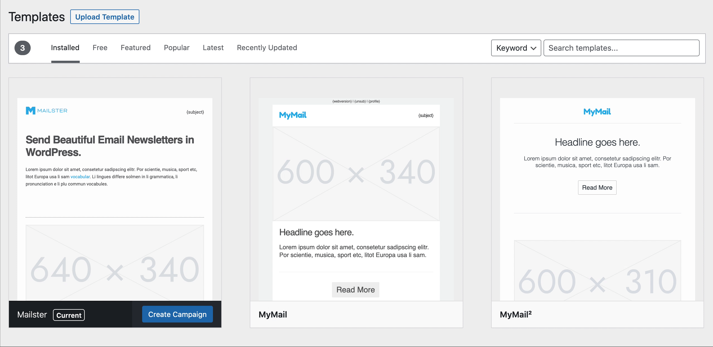

# Templates

Templates are an essential part of Mailster. They define the look and feel of your campaigns. You can find all installed templates at Newsletter => Templates.

?>Test this page on [our demo](https://demo.mailster.co/wp-admin/edit.php?post_type=newsletter&page=mailster_templates).

## Add new Templates

You can simple add new templates by clicking on the _Add New_ button

!> You can only upload valid Mailster ZIP templates. Other files will get rejected.

If you have uploaded your template you will see a success message and the new template in the list.

You can now start a new campaign with your new template:

