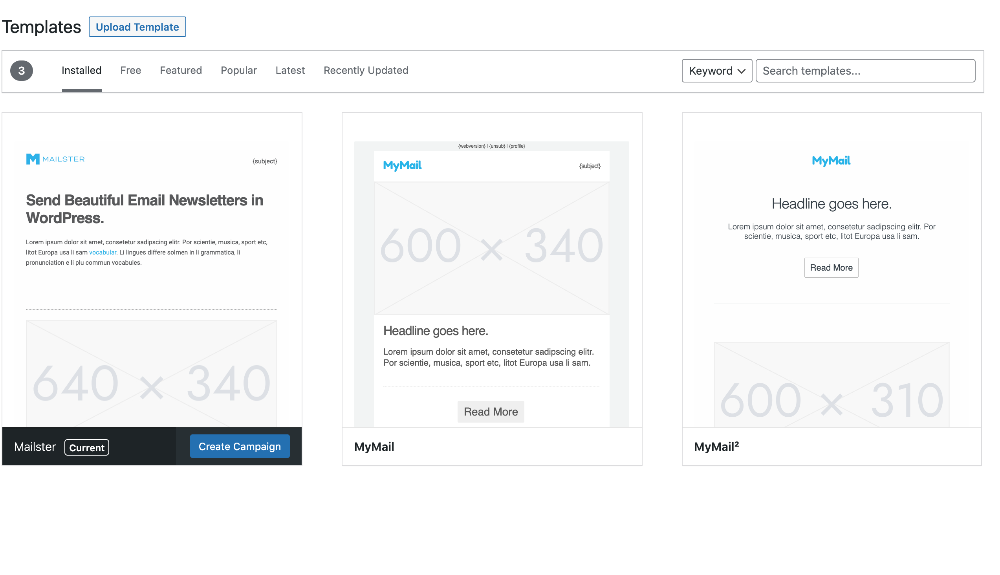

# Templates

Templates are an essential part of Mailster. They define the look and feel of your campaigns. You can find all installed templates at Newsletter => Templates.

?>Test this page on [our demo](https://demo2.mailster.co/wp-admin/edit.php?post_type=newsletter&page=mailster_templates).

### Add new Templates

If you have purchased [one of our templates](https://1.envato.market/c/1244590/275988/4415?u=https://themeforest.net/user/everpress/portfolio) or any third party templates which is compatibly with Mailster you can upload it directly in Mailster.

#### Extract the downloaded ZIP file

After you have downloaded and extracted the zip file from the Envato marketplace you can find another zip file with the name `[templatename]_for_mailster.zip`

Go to your WordPress site where you have installed Mailster and click on Newsletter => Templates.

You can simple add new templates by clicking on the **Add New** button.

!> You can only upload valid Mailster ZIP templates. Other files will get rejected.

If you have uploaded your template you will see a success message and the new template in the list.

You can now start a new campaign with your new template:

#### Add templates via the Envato API

Some templates - (including [ours from EverPress](https://1.envato.market/c/1244590/275988/4415?u=https://themeforest.net/user/everpress/portfolio)) - can be added to your site via the Envato API.

[Read more about adding templates via the Envato API](/templates-premium?id=download-via-envato-api).
